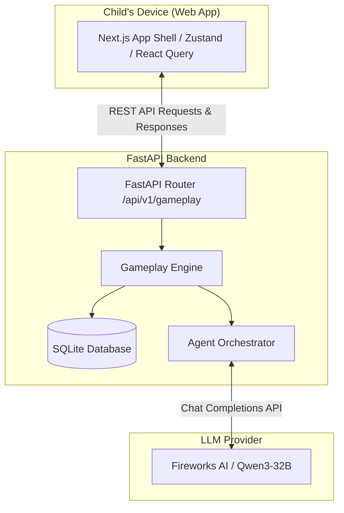
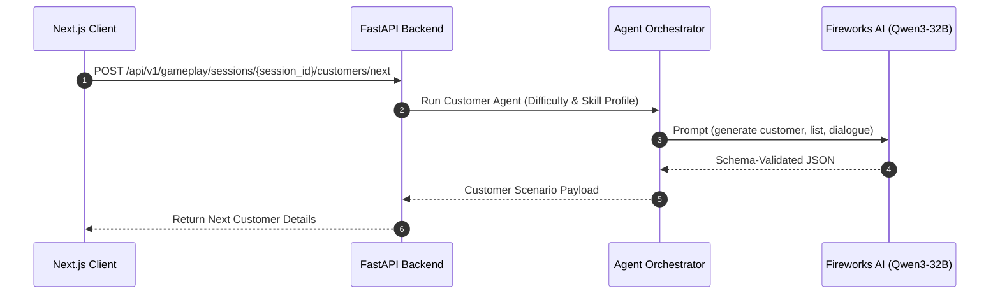
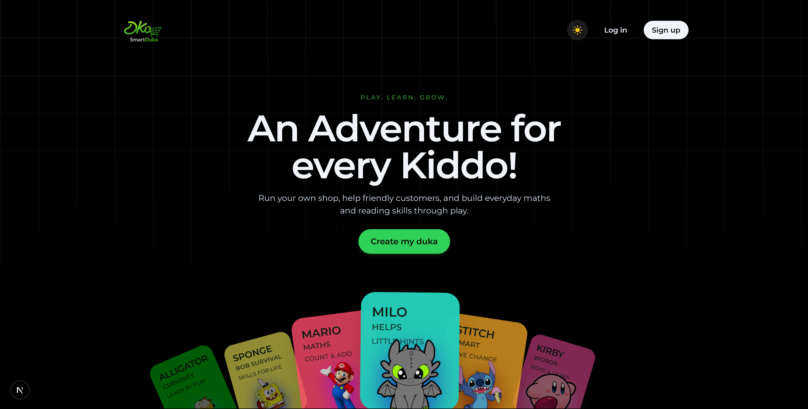
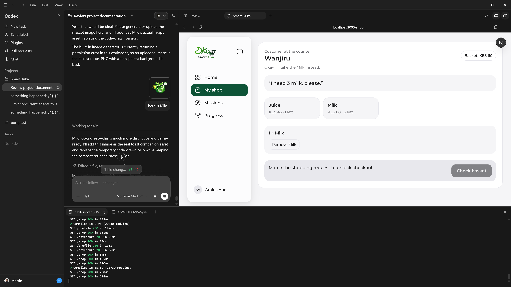
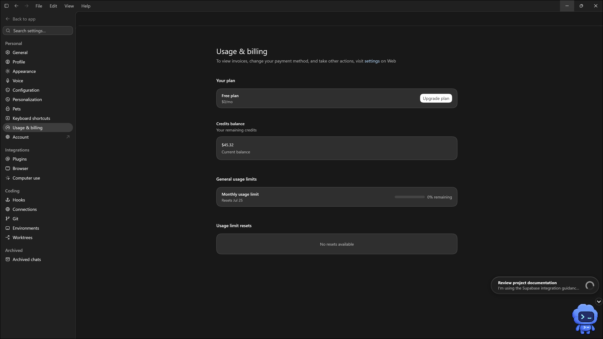
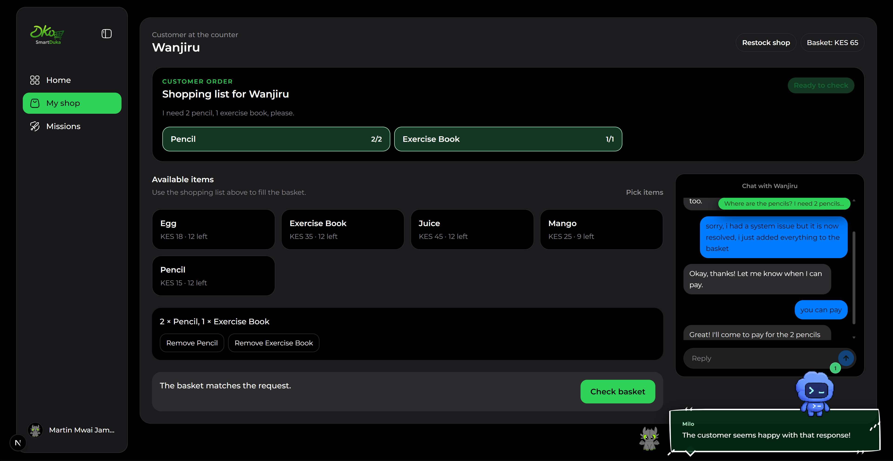
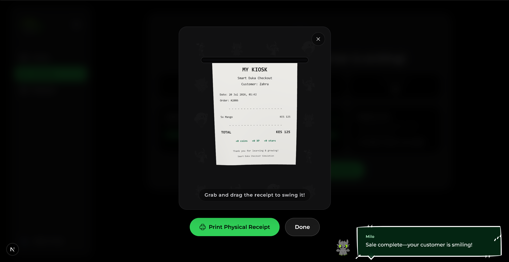

# SmartDuka

**An agentic AI learning game where Kenyan children practise maths and literacy by running a virtual corner shop — powered by Qwen3-32B on Fireworks AI and built with Codex.**

> OpenAI Build Week 2026 · Education Track · [openai.devpost.com](https://openai.devpost.com)

---

## The Problem

Over 90% of children in Sub-Saharan Africa cannot read or understand a simple text by age 10. Fewer than 1 in 3 can perform basic arithmetic by the end of Grade 3. No existing EdTech product addresses this in a way that is culturally relevant and adapts to each individual child.

The gap is not a content problem. It is a **relevance, access, and personalisation problem**.

---

## The Solution

Smart Duka is a game where a child runs a virtual *duka* — a Swahili corner shop. They serve AI-generated customers, read shopping lists in Swahili, calculate change in Kenyan Shillings, manage stock, and balance a daily ledger. The maths and literacy are not exercises layered onto a game. They are the game.

Three Fireworks AI / Qwen3-32B agents run concurrently in the background:

- **Customer Agent** — generates culturally grounded NPC customers with Kenyan names, local goods (unga, sukari, mandazi), and shopping lists calibrated to each child's skill level.
- **Tutor Agent** — tracks error patterns across transactions and injects contextual guidance via Milo, a toast-style mascot character, without interrupting the play flow.
- **Mission Agent** — generates daily narrative quests that give each session a story arc and a goal.

All three agents run on **Qwen3-32B**, dynamically personalizing customer dialogue, math challenge hints, and learning quests in real time.

---

## System Architecture



**The key architectural decision:** the application leverages a client-server architecture with Next.js on the frontend and FastAPI on the backend. AI orchestration is integrated directly into the gameplay loop, dynamically shaping customer interactions, tutor feedback, and learning difficulty based on player actions.

---

## Agent Orchestration Workflow



---

## Screenshots

| Dashboard & Missions | Shop Screen & Selected Items |
| :---: | :---: |
|  |  |
| **Milo Hints & Tutor Guidance** | **Stock Room & Supplier Restocking** |
|  |  |
| **First-Run Onboarding & Setup** | |
|  | |

---

## Demo

> 📹 **[Watch the 3-minute demo on YouTube](#)** *(link added before submission)*

**Demo flow:**
1. Child opens Smart Duka and lands on their dashboard — active mission shown.
2. They enter the shop. A live Qwen3-32B customer arrives with a Swahili shopping list.
3. Child selects items, calculates change, completes the transaction.
4. Milo (Tutor Agent) provides contextual feedback on a calculation error.
5. Out-of-stock negotiation: customer requests unavailable juice, agrees to take milk instead — the basket updates live.

---

## How We Used Codex

**Primary Codex Session ID:** `019f6a0b-5625-7a21-b715-debbb251489c`

### Collaboration Summary
We collaborated with Codex powered by **GPT 5.6 Terra** to build SmartDuka, leveraging its ability to dynamically scale reasoning (effortlessly switching from low-effort tasks for rapid scaffolding to high-effort modes for complex agent synchronization and edge-case testing). As an agentic partner, Codex was instrumental in rapidly building out SmartDuka's architecture: from database schemas and FastAPI contract layers to parallelized agent orchestrators and client-side Zustand store slices. 

Critically, development never stopped even when away from the laptop: using **Codex Mobile**, we could trigger edits, review code, and deploy features on the go from miles away. Codex made building continuous, highly autonomous, and incredibly fast.

<details>
<summary><strong>Read the full Codex collaboration story</strong></summary>

### What Codex built

Codex was not used as an autocomplete tool. It was used as a **coding agent**, given structured task specifications from our `/docs/` folder and asked to return working, tested code via pull requests.

**Codex built the following from natural-language specs:**

**Service worker and IndexedDB scaffolding**
Codex scaffolded the client-side IndexedDB database schema and PWA service worker configurations to prepare the app shell for future offline-first capability and local asset caching.

**FastAPI v1 contract layer**
All `/api/v1/` routes — auth, gameplay, missions, sync, progress, rewards — were scaffolded from `docs/08_API_SPECIFICATION.md`. Codex generated the route handlers, Pydantic v2 request/response models, and dependency injection patterns in one session. The parallel agent orchestration via `asyncio.gather` was Codex output.

**Agent orchestration pipeline**
The concurrent sync cycle — Customer Agent, Tutor Agent, Mission Agent — running concurrently, was built by Codex from `docs/06_AGENT_ARCHITECTURE.md`. Codex correctly implemented the fallback strategy: if an agent fails or returns unparseable JSON, it logs the raw output, returns cached content, and never surfaces the failure to the child.

**Adaptive difficulty system**
The difficulty tier model (7 tiers, tier transition logic, scenario selection weights) was built by Codex from the spec in `docs/05_EDUCATIONAL_MODEL.md`. Codex implemented the "never change tier mid-session" rule and the conservative skill profile update logic.

**PWA shell and responsive app shell**
Codex scaffolded the Next.js App Router structure, the Zustand store slices, the sidebar component (glassmorphism, floating, expandable, Framer Motion animated), and the game layout — all from the design system spec in `docs/13_UI_UX_GUIDELINES.md`.

**Schema-validated agent output**
Codex implemented the `try/except json.loads()` pattern for all agents with logging of invalid output. This was explicitly specified and Codex followed it without deviation.

**Test suites**
Unit tests for change calculation logic, basket validation, discount application, and bundle pricing were Codex output. These caught three edge cases in the division challenge that manual testing had missed.

**Codex Mobile & On-the-Go Development**
A game-changer during the hackathon was using **Codex Mobile**. Even when miles away from the workstation, development never stalled. We could seamlessly prompt updates, check test runs, and implement gameplay adjustments directly from a phone, proving that you never have to stop building just because you are on the go or away from your laptop.

### Where we made human decisions

- **The duka framing.** The core product insight — that a corner shop is the right cultural scaffold for East African early education — was a human decision made before a single line of code was written.
- **Milo's design.** The decision to use a toast-style mascot rather than an inline tutor panel was a UX call made after observing that children ignored overlay-style hints.
- **Out-of-stock negotiation flow.** The customer negotiation mechanic (customer requests unavailable item → agrees to substitute → basket updates) was designed by the product team. Codex implemented it from a precise spec.
- **Agent prompt engineering.** All system prompts in `backend/src/prompts/` were written by the team. Codex generated the scaffolding that loads and calls them — it did not author the prompts themselves.
- **The "never block gameplay" rule.** Every agent failure path returns cached content. This architectural principle was a deliberate human decision and was written into the spec before Codex touched the codebase.

### How Qwen3-32B powers the product at runtime

Qwen3-32B runs the concurrent agents during gameplay sessions:

```python
# backend/src/services/sync/orchestrator.py
async def run_sync(child_id: str, events: list[GameEvent]) -> SyncResponse:
    difficulty, skill_profile = await asyncio.gather(
        difficulty_agent.compute(child_id, events),
        tutor_agent.analyse(child_id, events)
    )
    scenarios, missions = await asyncio.gather(
        customer_agent.generate(difficulty, skill_profile),
        mission_agent.generate(difficulty, skill_profile)
    )
    return SyncResponse(scenarios=scenarios, missions=missions, ...)
```

Each agent calls the model with a system prompt loaded from disk and returns structured JSON validated against a Pydantic schema. Invalid output is logged and rejected. The configurable provider (`SMARTDUKA_LLM_PROVIDER`) means the same codebase can target Featherless (Fireworks) or other OpenAI-compatible completions endpoints.

</details>

---

## What's Built

| Feature | Status |
|---|---|
| Live Qwen3-32B customer scenarios (Kenyan names, Swahili, KES) | ✅ Done |
| Adaptive difficulty (7 tiers, error-pattern tracking) | ✅ Done |
| Tutor Agent — Milo feedback on transaction errors | ✅ Done |
| Mission Agent — daily narrative quests | ✅ Done |
| Client-side IndexedDB caching (PWA preparation) | ✅ Done |
| Shop session: inventory, restocking, limited stock | ✅ Done |
| Numeracy: change, multiplication, discounts, bundles, division | ✅ Done |
| Out-of-stock customer negotiation + basket substitution | ✅ Done |
| Cash ledger: revenue, expenses, profit, restock affordability | ✅ Done |
| Rewards, progress, achievements | ✅ Done |
| Dashboard, profile, sidebar, Milo polish | ✅ Done |
| System / Light / Dark mode | ✅ Done |
| FastAPI v1 contracts + Swagger docs | ✅ Done |
| Persistent demo data + runtime recovery | ✅ Done |

---

## Running the Project

### Prerequisites
- Node.js v18+
- Python 3.12+
- A OpenAI API/Featherless API key (set in your environment)

### 1. Frontend

```bash
cd frontend
npm install
npm run dev
# → http://localhost:3000
```

### 2. Backend

```bash
cd backend

# Create virtual environment
python3 -m venv venv
source venv/bin/activate        # macOS/Linux
# .\.venv\Scripts\Activate.ps1  # Windows

# Install dependencies
pip install -e ".[dev]"

# Configure environment
cp .env.example .env
# Set SMARTDUKA_FEATHERLESS_API_KEY, SMARTDUKA_FEATHERLESS_MODEL=Qwen/Qwen3-32B, and SMARTDUKA_LLM_PROVIDER=featherless

# Start the server
uvicorn src.main:app --reload
# → http://localhost:8000
# → Swagger docs at http://localhost:8000/docs
```

---

## Tech Stack

| Layer | Technology |
|---|---|
| Frontend | Next.js 16 (App Router), TypeScript, Tailwind CSS, Framer Motion, HugeIcons, Zustand |
| Caching | IndexedDB via `idb`, service worker shell |
| Backend | Python 3.12, FastAPI, SQLAlchemy async, Pydantic v2, Alembic |
| AI | Qwen3-32B via Fireworks AI / Featherless (provider-configurable) |
| Build agent | OpenAI Codex |
| Database | SQLite + aiosqlite (dev) |

---

## The Impact

Smart Duka targets a problem that affects hundreds of millions of children. The duka mechanic works because every East African child already understands a corner shop — the cultural context is not learned, it is lived. Qwen3-32B makes the experience infinite and personalised.

Financial literacy is not a bonus feature. In a region where 70%+ of adults are excluded from formal financial systems, teaching a child to calculate change, manage a budget, and understand profit before age 10 is an intervention with 30-year compounding returns.

---

## Track

**Education** — Smart Duka addresses numeracy, literacy, and financial literacy simultaneously, for children aged 4–13, in a region where the learning crisis is most acute.

---

## Built By

**Martin Mwai** — [@lemonhead-ai](https://github.com/lemonhead-ai) · Nairobi, Kenya

*Computer Science graduate, Kisii University. Crafting fluid animations and effortlessly immersive user experiences.*

---

## License

MIT — see [LICENSE](./LICENSE)
