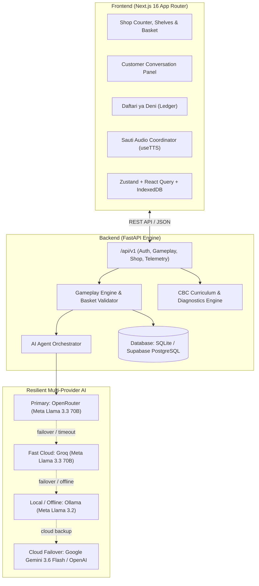

# SmartDuka

**An agentic AI learning game where Kenyan children master CBC numeracy, literacy, and financial skills by running a virtual corner shop — powered by Meta Llama 3.3 70B via OpenRouter & Groq, with offline Ollama local fallback.**

> CBC (Competency-Based Curriculum) Aligned · Early Primary (Grade 1–4) · Built with Next.js 16 & FastAPI

---

## The Mission

Over 90% of children in Sub-Saharan Africa cannot read or understand a simple text by age 10, and fewer than 1 in 3 can perform basic arithmetic by the end of Grade 3. Most existing EdTech products rely on dry, abstract drills that feel disconnected from a child's everyday reality.

**SmartDuka** flips the classroom into a familiar neighborhood *duka* (corner shop). The math, reading, and financial decisions are not tacked onto a game — **running the shop is the game**. 

Children welcome AI customers speaking Sheng, Swahili, and English, calculate change in Kenyan Shillings (KES), balance their *Daftari ya Deni* (credit ledger), inspect food hygiene in the store, and solve curriculum-aligned math puzzles with the help of **Milo**, their friendly shop mentor.

---

## Key Features & Pedagogical Systems

### 1. Multi-Provider Agentic AI (Meta Llama 3.3 70B)
SmartDuka features an autonomous AI orchestrator with sub-3-second response times and intelligent fallback failovers:
- **Customer Agent**: Generates culturally authentic Kenyan customers (e.g., Amani, Baraka, Tatu, Wanjiku) with unique personalities, shopping requests, and adaptive difficulty.
- **Conversational Customer Chat**: Customers dynamically negotiate when items are low in stock (e.g., agreeing to substitute juice for milk, accepting partial stock), updating the counter basket in real time.
- **Tutor Agent (Milo)**: Watches error patterns across transactions and delivers gentle, encouraging Socratic hints without breaking gameplay flow.
- **Mission Agent**: Crafts daily narrative quests (e.g., *"Earn 200 KES to buy new crates"*, *"Serve 3 customers without basket errors"*).

### 2. Kenyan CBC Curriculum Alignment
Designed to reflect Kenya's **Competency-Based Curriculum (CBC)** for Grades 1 through 3:
- **Strand 1.0 — Numbers**: Counting, addition, subtraction, bundle multiplication, and fair division.
- **Strand 2.0 — Measurement & Money**: Kenyan Shilling (KES) currency calculations, change calculation, and percentage discounts (with exact decimal and rounded shilling support).
- **Strand 3.0 — Language & Literacy**: Bilingual shopping lists (Swahili & English), vocabulary word-item matching, and reading comprehension.
- **Strand 4.0 — Hygiene & Nutrition**: Safe storekeeping, refrigeration rules for perishables (milk, dairy), and shelf inspection.

### 3. *Daftari ya Deni* (Credit Ledger & Trust System)
Teaches real-world micro-commerce and community economics:
- Trusted neighborhood customers can request items on store credit (*deni*).
- Children evaluate customer creditworthiness, record debits, and balance repayment ledgers.

### 4. Sauti Audio & Voice Synthesis (TTS)
- Voice support across dialogue, shopping lists, and items in both English and Swahili.
- Synchronized audio coordinator preventing dual-voice collisions, leveraging Web Speech API with cached server-side synthesis fallbacks.

### 5. 3D Interactive Receipts & Analytics
- Dynamic 3D sale completion cards showing breakdown of items, discounts, cash tendered, and change given.
- Diagnostic analytics tracking error taxonomy categories (`arithmetic_calculation`, `credit_balance`, `reading_interpretation`, `storage_hygiene`).

---

## System Architecture


```mermaid
graph TD
    subgraph Client ["Frontend (Next.js 16 App Router)"]
        UI["Shop Counter, Shelves & Basket"]
        Chat["Customer Conversation Panel"]
        Deni["Daftari ya Deni (Ledger)"]
        TTS["Sauti Audio Coordinator (useTTS)"]
        State["Zustand + React Query + IndexedDB"]
    end

    subgraph Server ["Backend (FastAPI Engine)"]
        Router["/api/v1 (Auth, Gameplay, Shop, Telemetry)"]
        Engine["Gameplay Engine & Basket Validator"]
        CBC["CBC Curriculum & Diagnostics Engine"]
        Orchestrator["AI Agent Orchestrator"]
        DB[("Database: SQLite / Supabase PostgreSQL")]
        
        Router --> Engine
        Router --> CBC
        Engine --> DB
        Engine --> Orchestrator
    end

    subgraph AI_Layer ["Resilient Multi-Provider AI"]
        direction TB
        P1["Primary: OpenRouter (Meta Llama 3.3 70B)"]
        P2["Fast Cloud: Groq (Meta Llama 3.3 70B)"]
        P3["Local / Offline: Ollama (Meta Llama 3.2)"]
        P4["Cloud Failover: Google Gemini 3.6 Flash / OpenAI"]
        
        Orchestrator --> P1
        P1 -.->|failover / timeout| P2
        P2 -.->|failover / offline| P3
        P3 -.->|cloud backup| P4
    end

    Client <-->|REST API / JSON| Router
```

---

## Tech Stack

| Layer | Technologies |
|---|---|
| **Frontend** | **Next.js 16** (App Router, React 19), **TypeScript**, **Tailwind CSS**, **Framer Motion**, **Zustand**, **TanStack React Query**, **HugeIcons** |
| **PWA & Offline** | Service Worker, IndexedDB caching via `idb`, Web Speech API |
| **Backend** | **Python 3.12+**, **FastAPI**, **Pydantic v2**, **SQLAlchemy (Async)**, **Alembic**, **Uvicorn**, **Ruff** |
| **Primary AI Engine** | **Meta Llama 3.3 70B Instruct** (via OpenRouter & Groq) |
| **Local AI Engine** | **Meta Llama 3.2** on-device via **Ollama** (zero cost, fully offline capable) |
| **AI Fallback** | **Google Gemini 3.6 Flash** & **OpenAI** compatible endpoints |
| **Database** | **SQLite + aiosqlite** (Local Dev) · **Supabase PostgreSQL** via Connection Pooler / Supavisor (Production) |
| **Cloud Hosting** | **Render** (Backend API) · **Vercel / Next.js hosting** (Frontend Web App) |

---

## Getting Started

### Prerequisites
- **Node.js** v18.18+ or v20+
- **Python** 3.12+
- *(Optional for cloud AI)* An API key from **OpenRouter** or **Groq** (or Google Gemini)
- *(Optional for offline AI)* **Ollama** with `llama3.2` installed: `ollama run llama3.2`

---

### 1. Backend Setup

```bash
cd backend

# 1. Create and activate virtual environment
python -m venv venv
# On Windows (PowerShell):
.\venv\Scripts\Activate.ps1
# On macOS/Linux:
source venv/bin/activate

# 2. Install dependencies (including development and testing tools)
pip install -e ".[dev]"

# 3. Setup environment variables
cp .env.example .env
```

Edit `backend/.env` with your preferred AI provider:
```env
# Choose: openrouter | groq | ollama | gemini
SMARTDUKA_LLM_PROVIDER=openrouter

# OpenRouter (Meta Llama 3.3 70B)
SMARTDUKA_OPENROUTER_API_KEY=your-openrouter-key
SMARTDUKA_OPENROUTER_MODEL=meta-llama/llama-3.3-70b-instruct

# Local development database (SQLite)
SMARTDUKA_DATABASE_URL=sqlite+aiosqlite:///./smartduka.local.db
```

Start the backend API server:
```bash
uvicorn src.main:app --reload --port 8000
```
- **API Root**: [http://localhost:8000](http://localhost:8000)
- **Interactive Swagger Docs**: [http://localhost:8000/docs](http://localhost:8000/docs)
- **Health Check**: [http://localhost:8000/api/v1/health](http://localhost:8000/api/v1/health)

---

### 2. Frontend Setup

```bash
cd frontend

# Install packages
npm install

# Start development server
npm run dev
```
Open [http://localhost:3000](http://localhost:3000) in your browser.

---

## Testing & Quality Assurance

SmartDuka maintains an automated test suite enforcing both mathematical accuracy, gameplay logic, and AI runtime resilience:

```bash
# In the backend directory:
# Run full gameplay engine tests (Basket matching, discounts, ledger, change calculation)
pytest tests/test_gameplay_engine.py

# Run AI runtime orchestrator tests (OpenRouter, Groq, Ollama, and Fallback providers)
pytest tests/test_ai_runtime.py

# Format and lint code with Ruff
python -m ruff format --check .
python -m ruff check .
```

---

## Pedagogical Framework

```
Early Primary CBC Competency Strands
 ├── 1.0 Numbers
 │    ├── Whole Numbers & Counting
 │    ├── Addition & Subtraction (Giving Change)
 │    └── Multiplication & Fair Division
 ├── 2.0 Measurement & Trade
 │    ├── Kenyan Shillings & Cents (KES)
 │    ├── Percentage Discounts (Bundle pricing)
 │    └── Credit Accounting (Daftari ya Deni)
 ├── 3.0 Language & Communication
 │    ├── Conversational Dialogue (Swahili / English)
 │    └── Reading Comprehension & Spelling
 └── 4.0 Science & Hygiene
      ├── Store Hygiene Inspection
      └── Perishable Food & Dairy Cold Storage
```

---

## Author

**Martin Mwai** — [@lemonhead-ai](https://github.com/lemonhead-ai) · Nairobi, Kenya  
*Computer Science graduate, Kisii University. Passionate about empowering early childhood education through culturally grounded agentic AI.*

---

## License

This project is licensed under the [MIT License](./LICENSE).

